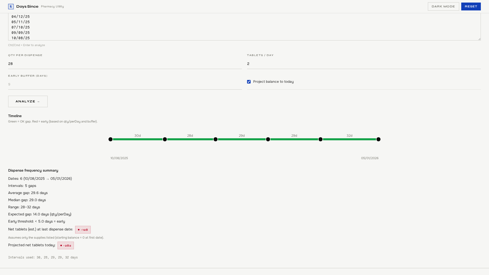

# Days Since for Pharmacists

Fast, simple, and private. **Days Since for Pharmacists** is a lightweight web tool to calculate “days since” a supply date and (optionally) estimate medication supply remaining. It is built for quick **due vs too early** checks in busy pharmacies.

**Try it now →** https://itstongy.github.io/Days-Since-for-Pharmacists/


## Why pharmacists use it

- **Save time**: no more counting days on a calendar or doing manual date math
- **Reduce errors**: consistent “too early vs due” checks with a clear buffer
- **Stay fast at the counter**: works in seconds, on any device, no logins
- **Privacy‑friendly**: runs fully in your browser, nothing is saved or sent

## What it does

- Calculates **days since** a date
- Estimates **days of medication supply** if you enter amount + tablets per day
- Flags **OK to supply vs too early** based on an early‑supply buffer
- Shows **“can supply on”** date when tablets/day is provided
- **Dispense history timeline**: paste multiple dispense dates to see average gap + a colour timeline (green OK / red early)
- Optional **tablet ledger** projection (net balance at last date, plus today if toggled)

## Dispense history timeline (multiple dates)

Open **“Dispense history timeline”** and paste dispense dates.



### Inputs

- **Dispense dates:** one per line (or separated by spaces/commas)
- Optional:
  - **Quantity supplied each time** (assumes the same quantity for all dispenses)
  - **Tablets per day** (assumes constant daily use)
  - **Allowed early (days)** (default 9)

### Accepted date formats

- `DD/MM`, `DD/MM/YY`, `DD/MM/YYYY`
- Compact: `DDMM`, `DDMMYY`, `DDMMYYYY` (e.g. `2701` or `270126`)

### What the timeline shows

- Each **dot** is a dispense date.
- The spacing reflects the actual time between dispenses.
- Each segment between dates is labelled with the **gap in days**.
- With quantity + tablets/day entered:
  - Expected days of supply = `quantity / tabletsPerDay`
  - Early threshold = `expectedDaysOfSupply − bufferDays`
  - Segment is **red** if: `gapDays < (expectedDaysOfSupply − bufferDays)`
  - Segment is **green** otherwise.

### “Net tablets” estimate (ledger)

The tool can also estimate a running “tablet balance” over the date range:

- Assumes **starting balance = 0** at the first date you entered.
- Adds `quantity` at each dispense date.
- Subtracts consumption between dates: `gapDays × tabletsPerDay`.

It reports:

- **Net tablets at last dispense date** (does not “ghost consume” beyond your last entered date)
- Optional: **Projected net tablets today** (toggle in the UI)

> Caveat: This assumes the dates you entered represent all supplies (no other supplies elsewhere) and that use is constant.

## Privacy first

This tool runs entirely in your browser. **No data is saved, stored, or sent anywhere.**

## Power‑user URL formats

- `?s=25/06` or `?s=25/06/2025`
- `?s=25/06 30 1` (date, amount, per‑day)
- `?s=25/06 30 1 9` (buffer days as 4th token)
- `?date=25/06/2025&amount=30&perDay=1&buffer=9`

## Development

### Requirements

- Node.js 18+ (20+ recommended)
- npm

### Setup

```bash
npm install
npm run dev
```

### Scripts

- `npm run dev` — start Vite dev server
- `npm run build` — build the static site to `dist/`
- `npm run preview` — preview the production build locally
- `npm run typecheck` — TypeScript checks
- `npm run lint` — ESLint
- `npm run format` — Prettier (Tailwind plugin enabled)
- `npm run test` — Vitest unit tests

### GitHub Pages

The Vite base path is set to `/Days-Since-for-Pharmacists/` to support GitHub Pages.
Deploys from `dist/` via the GitHub Actions workflow in `.github/workflows/pages.yml`.
